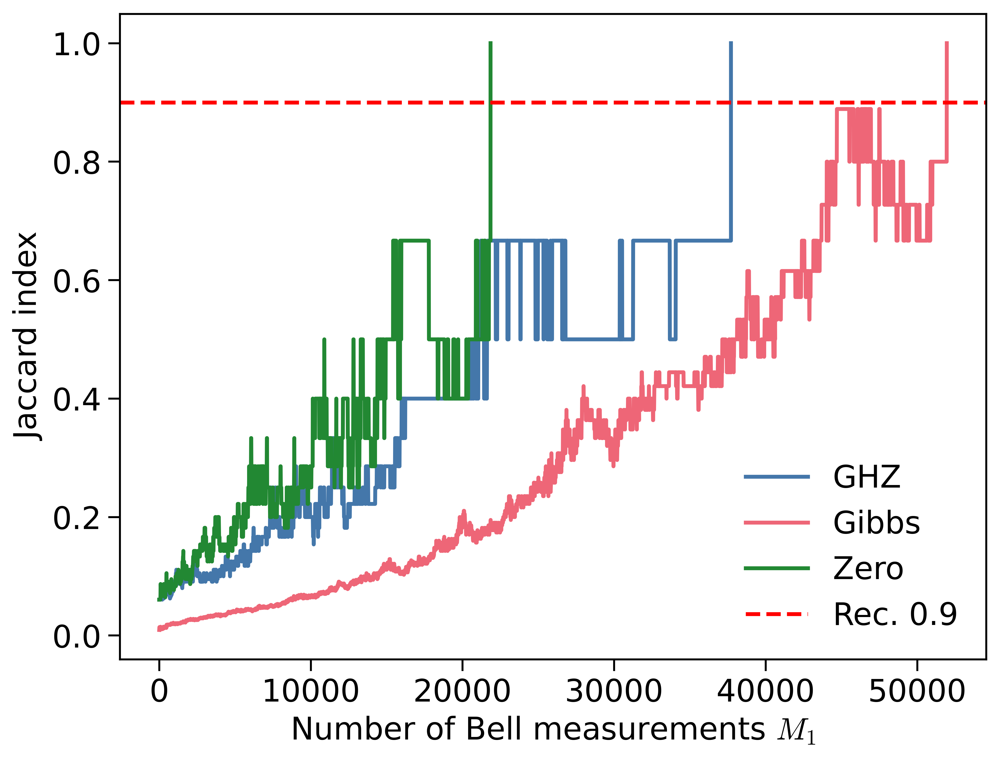
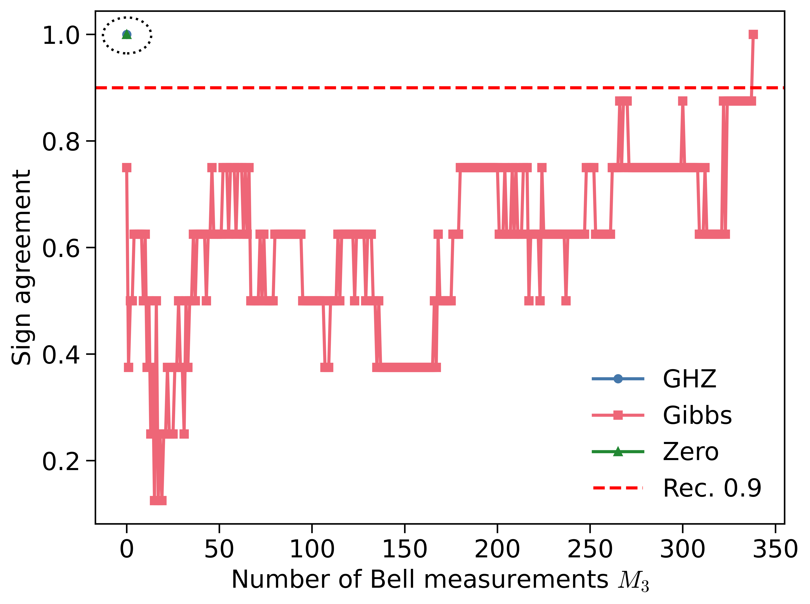
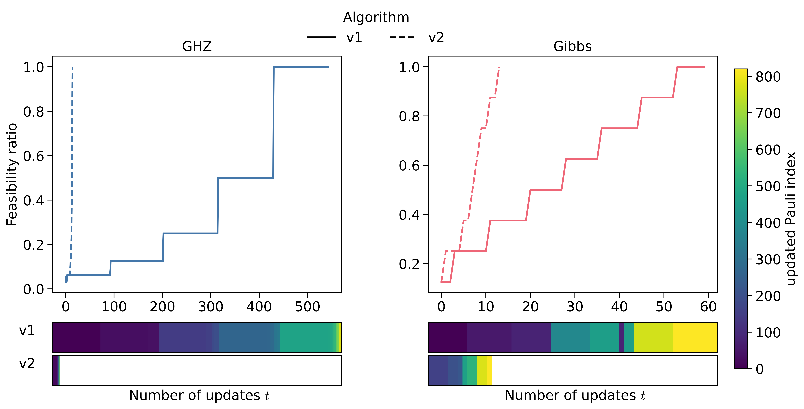
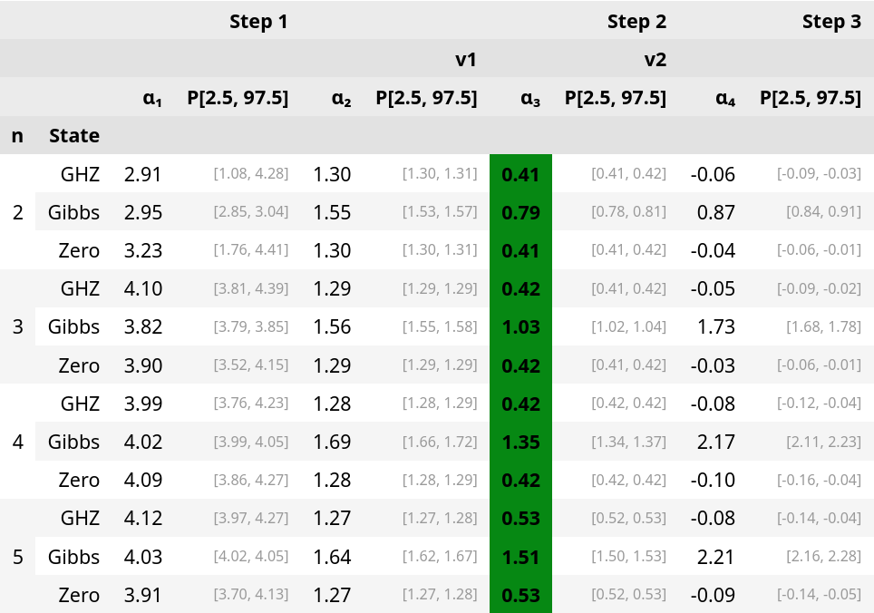

# Code for "One, Two, Three: One Empirical Evaluation of a Two-Copy Shadow Tomography Scheme with Triple Efficiency"

This repository contains the implementation of the numerical studies presented in the paper:

> **"One, Two, Three: One Empirical Evaluation of a Two-Copy Shadow Tomography Scheme with Triple Efficiency"**  
> Viet T. Tran, Richard Kueng (2025)

---

## Reproducing Experiments

### Environment Setup

- **1. Create a Conda environment**
  ```bash
  conda create -n <env_name>
  conda activate <env_name>
  conda install -c conda-forge uv
  ```

- **2. Install dependencies**
  ```bash
  uv init
  ```

- **3. Install local package**
  ```bash
  uv pip install -e .
  ```

---

### Workflow Steps

- **Step 0 — Generate test states**  
  Generate GHZ, zero, and Gibbs states for `n=2,3,4,5`:
  ```bash
  uv run python -m scripts.generate_test_states
  ```
  To generate larger states, modify the main loop in the script.
  Output folders: `./data/normalized_gibbs/`, `./data/special_states/`

- **Step 1 — Study support recovery**
  ```bash
  uv run python -m scripts.study_support_recovery --n 2 3 4 5 --eps 0.05 0.11 0.34
  uv run python -m scripts.study_support_recovery --n 2 3 4 5 --eps 0.05 0.11 0.34 --specialstates --datadir special_states
  ```

- **Step 2 — Mimicking state construction**
  ```bash
  uv run python -m scripts.study_mimicking_state_construction --n 2 3 4 5 --eps 0.05 0.11 0.34 --algo both
  uv run python -m scripts.study_mimicking_state_construction --n 2 3 4 5 --eps 0.05 0.11 0.34 --algo both --specialstates --datadir special_states
  ```

- **Step 2.5 — Precompute Bell probabilities**  
  With GPU:
  ```bash
  uv run python -m scripts.precompute_bell_probs --gpu 0 1 --n 2 3 4 5 --eps 0.05 0.11 0.34
  uv run python -m scripts.precompute_bell_probs --gpu 0 1 --n 2 3 4 5 --eps 0.05 0.11 0.34 --specialstates --datadir special_states
  ```
  Or with CPU:
  ```bash
  uv run python -m scripts.precompute_bell_probs --cpu --n 2 3 4 5 --eps 0.05 0.11 0.34
  uv run python -m scripts.precompute_bell_probs --cpu --n 2 3 4 5 --eps 0.05 0.11 0.34 --specialstates --datadir special_states
  ```

- **Step 3 — Sign reconstruction**
  ```bash
  uv run python -m scripts.study_sign_reconstruction --n 2 3 4 5 --eps 0.05 0.11 0.34
  uv run python -m scripts.study_sign_reconstruction --n 2 3 4 5 --eps 0.05 0.11 0.34 --specialstates --datadir special_states
  ```


<!-- > **Alternative:** You can skip the above steps and directly download the computation results from:  
> https://zenodo.org/records/15267965  
> Extract `approx_recovery_jacc.tar.gz` to `data/results/approx_recovery_jacc/` (note: unpacked size ~90GB) -->
> **Alternative:** Instead of running all steps locally, you can download the computation results from:  
> 
> [](https://doi.org/10.5281/zenodo.15267965)
> 
> After downloading, extract `approx_recovery_jacc.tar.gz` into `data/results/approx_recovery_jacc/`.  
> **Note:** The extracted data requires approximately 90GB of disk space.

---

### Reproducing Plots

After running the experiments or downloading the dataset, your folder should include:
```bash
data/
├── normalized_gibbs/
├── special_states/
└── results/
    └── approx_recovery_jacc/
        ├── n2_eps0.34_type=zero/
        │   ├── results_<timestamp>.pkl
        │   ├── measurements_<timestamp>.pkl
        │   ├── mimicking_results_v1_<timestamp>.pkl
        │   ├── mimicking_results_v2_<timestamp>.pkl
        │   └── stage3_results_<timestamp>.pkl
```

Open the notebooks:
- `notebooks/02_main_plots.ipynb`
- `notebooks/03_other_plots_and_table.ipynb`

These reproduce the main figures and tables from the paper.

> **Note:** The default config reproduces a reduced-scale version of the data, for compatibility with limited compute.As a result, numerical results differ slightly from those reported in the paper.


---

## Example Results

Below are selected figures generated using the reduced dataset from this repository (see `notebooks/02_main_plots.ipynb`).

Left: Support recovery, Right: Sign reconstruction.
<div align="center">
  
  
</div>


Mimicking state construction.
<div align="center">
  
</div>


The table below summarizes fit results for key quantities across steps 1–3 (support recovery, mimicking state construction, and sign reconstruction), evaluated on GHZ, Gibbs, and zero states for varying system sizes. Each value represents the median fit parameter along with its 95% confidence interval (see `notebooks/03_other_plots_and_table.ipynb`).

<div align="center">
  
</div>